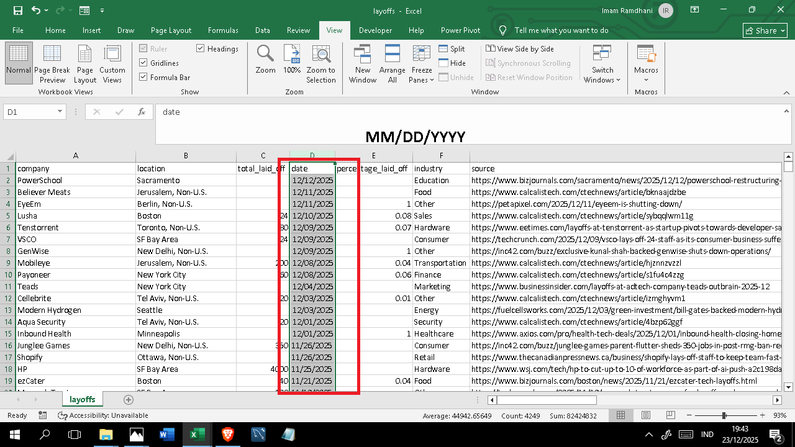
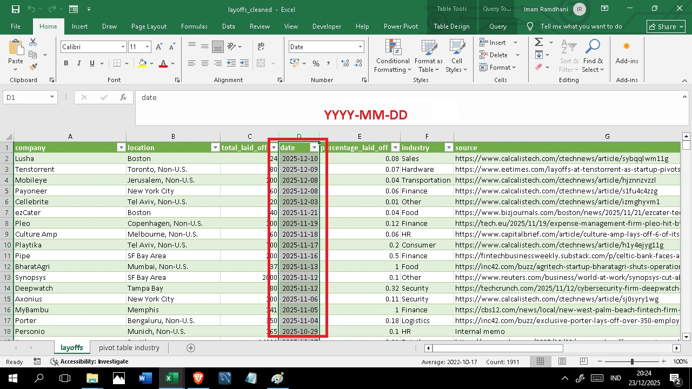

# 🧹 Global Layoffs Data Cleaning Project

## Project Overview
**Goal:** To transform a raw, messy dataset of global layoffs (2020-2025) into a high-quality, SQL-ready format.
**Tools Used:** Microsoft Excel (Data Tools, Pivot Tables, Formulas, Custom Formatting).

---

## The Problem (Raw Data)
The initial dataset (`layoffs_raw.csv`) contained **4,249 rows** with critical issues:
1.  **Format Incompatibility:** Dates stored as text, unusable for SQL sorting.
2.  **Data Noise:** 55% of the dataset contained null values (blanks) in key metrics.
3.  **Integrity Risks:** Potential duplicates and inconsistent text formatting.

---

## Cleaning Process (Step-by-Step)

### 1️⃣ Step 1: Data Integrity Check (Duplicates)
**Objective:** Ensure every record is unique before processing.
* **Action:** I scanned the entire dataset using the *Remove Duplicates* tool across all columns.
* **Result:** **No duplicates found.** The system confirmed the raw data was unique.

*(Fig 1: System confirmation that the raw dataset contained no duplicates)*

---

### 2️⃣ Step 2: Standardization Audit (Quality Control)
**Objective:** Detect and fix spelling inconsistencies in categorical columns (e.g., typos in Industry names).
* **Action:** Created a **Pivot Table** on the `Industry` column to group and inspect all unique values.
* **Result:** **Verified Clean.** Industry names were standardized (e.g., "Crypto" was consistent, no variations like "CryptoCurrency").

*(Fig 2: Pivot table summary used for manual visual inspection)*

---

### 3️⃣ Step 3: Date Formatting (Before vs After)
**Objective:** Convert the `Date` column from Text format into a proper Date Object compatible with MySQL.
* **Problem:** Raw dates were stored as text with inconsistent separators (`MM/DD/YYYY`).
* **Action:** Used **Text to Columns** to parse the data and applied Custom Formatting `YYYY-MM-DD`.

**❌ BEFORE (Raw Text):**

**✅ AFTER (SQL Standard):**

---

### 4️⃣ Step 4: Removing Null Values (Before vs After)
**Objective:** Remove rows that provide no analytical value (noise).
* **Problem:** Rows where both `total_laid_off` AND `percentage_laid_off` were `Null` (Blank).
* **Action:** Filtered and **deleted ~2,338 rows** of useless data.

**❌ BEFORE (Raw Data - 4,249 Rows):**

*(Fig: Filter shows '(Blanks)' present. Original count: 4,249 rows)*

**✅ AFTER (Cleaned - 1,911 Rows):**

*(Fig: Blanks removed. Final count: 1,911 rows ready for SQL)*

---

## Final Summary

| Metric | Count | Note |
| :--- | :--- | :--- |
| **Original Rows** | 4,249 | Raw Data |
| **Rows Removed** | ~2,338 | Unusable data (double nulls) |
| **Final Rows** | **1,911** | Clean, high-quality data |

---

## 📁 Files Included
* `layoffs_raw.csv`: Original dataset.
* `layoffs_cleaned_final.csv`: Processed dataset (Saved in CSV UTF-8 format).
